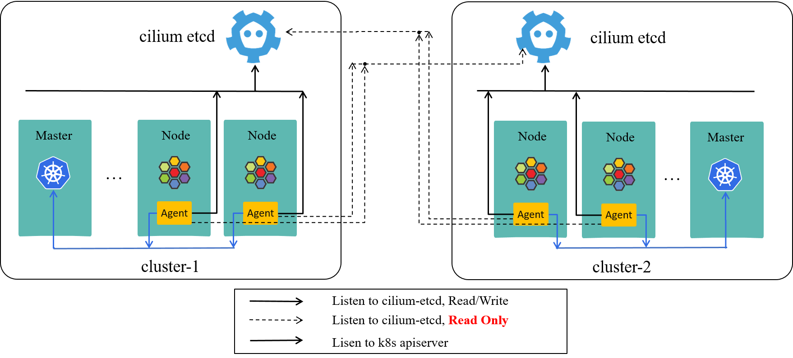
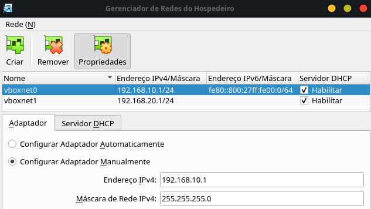
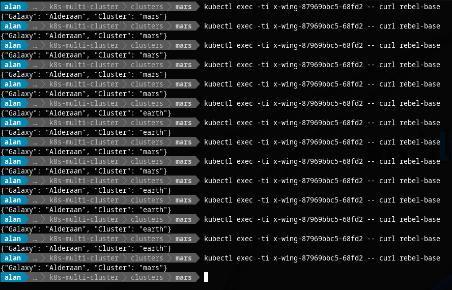

# Connecting Kubernetes Clusters

Using Cilium CNI for cluster mesh and containerd for CRI

<p align="center">
  
</p>

## Requirements

- VirtualBox
- Vagrant
- kubectl
- Helm v3
- Ansible >= 2.10
  - Ansible Galaxy Collections:
    - `community.kubernetes`
- Make

Minimal machine requirements:

- Linux
- 16GB Ram
- 8 vCPUS


Requires VirtualBox network configured equals this example:

- **Name:** `vboxnet0`
  **CIDR:** `192.168.10.1/24`
- **Name:** `vboxnet1`
  **CIDR:** `192.168.20.1/24`



## Scenario

Vagrant and VirtualBox is used to provide infrastructure.
Ansible is used to provide installations and configurations in the clusters.

**Clusters:**

| Name | Nodes | Kubeconfig |
|---|---|---|
| `earth` | `master`, `node-1` | `clusters/earth/kube-config`
| `mars` | `master`, `node-1` | `clusters/mars/kube-config`

## Setup

Create cluster and install Cilium and MetalLB components:

```sh
make
```

Destroy clusters:

```sh
make destroy
```

Test connective example:

```sh
$ kubectl -n kube-system exec -ti cilium-nwvdk -- cilium node list

Name           IPv4 Address    Endpoint CIDR   IPv6 Address   Endpoint CIDR
earth/master   192.168.10.10   10.2.0.0/24                    
earth/node-1   192.168.10.11   10.2.1.0/24                    
mars/master    192.168.20.10   10.4.0.0/24                    
mars/node-1    192.168.20.11   10.4.1.0/24
```



## See More

- [Cilium](https://cilium.io/)
  - [Cluster Mesh](https://docs.cilium.io/en/v1.9/gettingstarted/clustermesh/)
- [CloudNativeCon 2018](https://www.youtube.com/watch?v=U34lQ8KbQow)